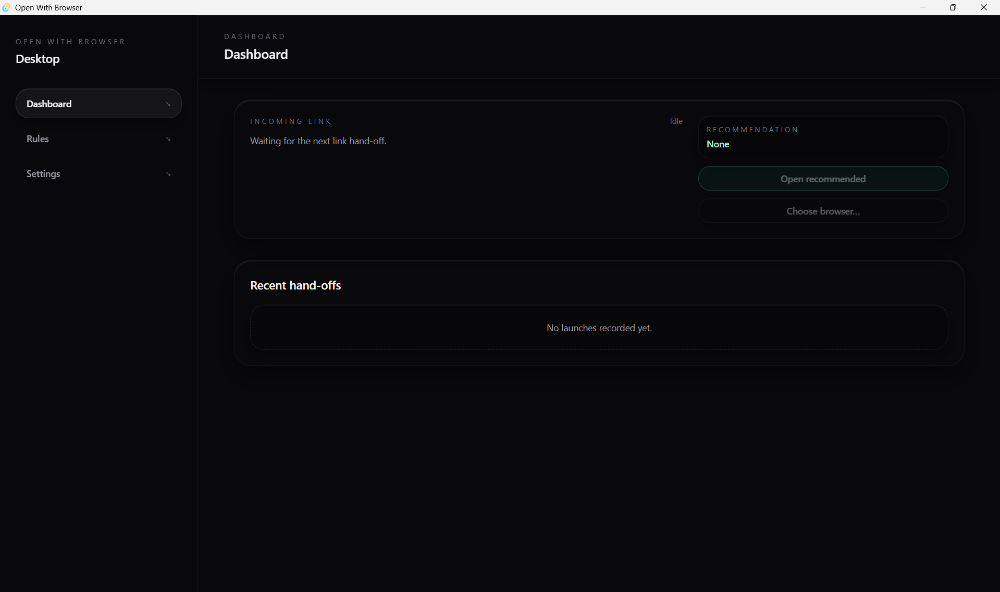
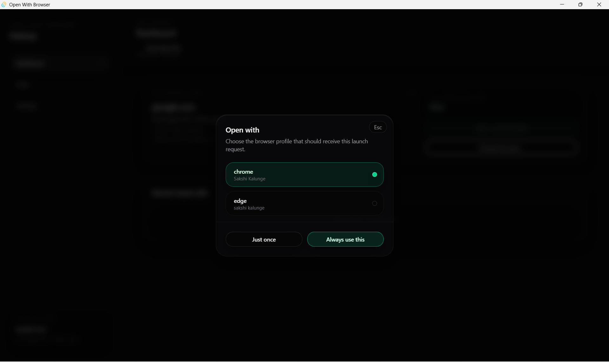
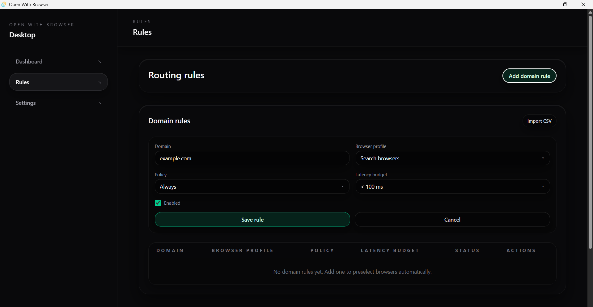
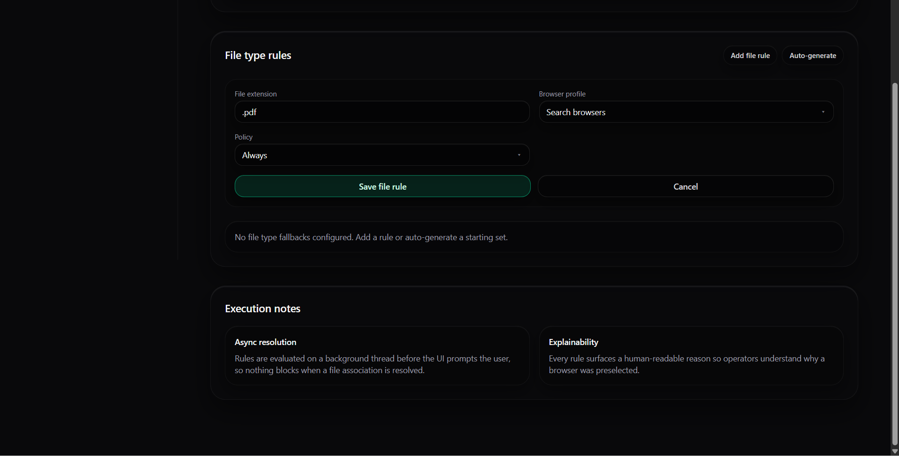
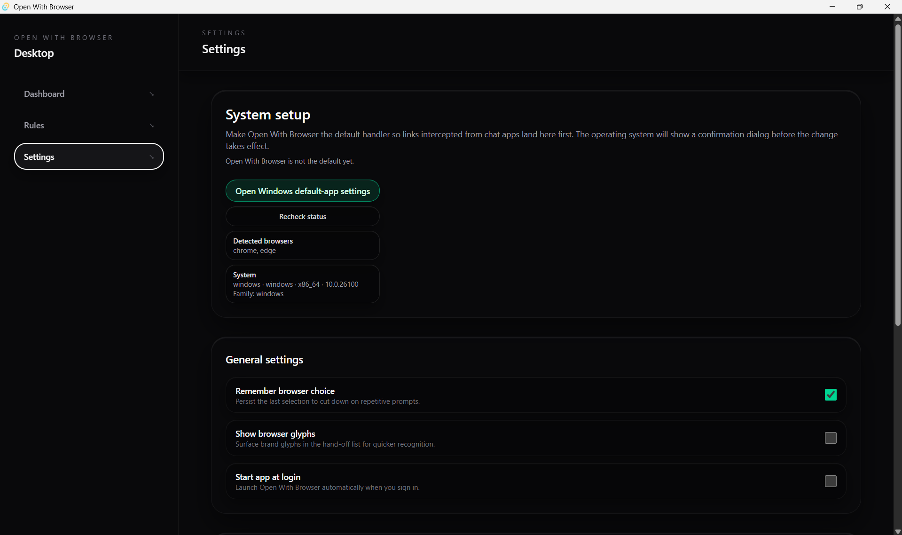
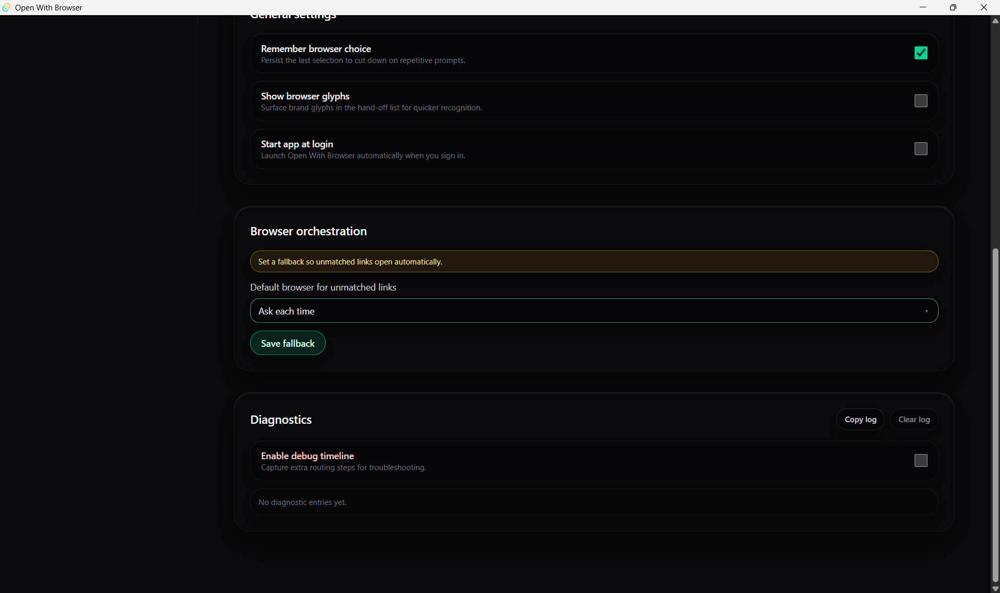

# Open With Browser Documentation

Welcome to the Open With Browser documentation. This collection of guides helps developers and users understand how the application works with different browsers and their profiles across operating systems.

## Browser Profile Documentation

### Platform-Specific Guides
- **[Windows Browser Profiles](./windows-browser-profiles.md)** - Complete guide to browser profile paths on Windows for Chrome, Edge, Brave, and Firefox

### Planned Documentation
- **macOS Browser Profiles** - Browser profile paths for macOS systems
- **Linux Browser Profiles** - Browser profile paths for various Linux distributions
- **Browser Discovery Implementation** - Technical guide for implementing browser detection
- **Profile Launching Guide** - How to launch browsers with specific profiles
- **Cross-platform Browser Paths** - Unified approach to browser discovery across platforms

## Architecture Documentation

### Core Components
- **Rule Engine** - URL pattern matching and routing logic
- **Browser Discovery** - Automatic detection of installed browsers
- **Profile Resolution** - Finding and validating browser profiles
- **Link Opener** - Launching browsers with appropriate arguments

### Development Guides
- **Contributing to Browser Support** - Adding support for new browsers
- **Testing Profile Discovery** - Validation and testing strategies
- **Security Considerations** - Best practices for accessing user data

## Screenshots and Page Overview

### 1. Dashboard

The main landing page gives users a quick overview of the application's real-time status and recent activity. It shows the status of any Incoming Link request and tracks Recent hand-offs made by the application.

### 2. The Open With Dialog 

This is the compact, essential pop-up window that appears when a link is intercepted and no rule is matched. It prompts the user to make a manual, immediate routing decision.
### 3. Rules Page

The Rules page is the central control panel for automating link and file routing in the application. It allows users to define explicit logic for the app to follow, preventing the need for manual selection.

The page's main function is split into two sections:
- Domain Rules:   
Used to automatically direct web links based on the website's domain to a specific browser profile.
- File Type Rules:    
Used to assign specific file extensions (like .pdf or .fig) to a designated browser.
### 4. Settings

The Settings page is the application's control center for managing how it integrates with the operating system and how it handles links by default.

The page's main function is divided into three key areas:
- System Setup:       
Used to establish the application as the default browser handler on the OS and displays detected browsers.
- General Settings:    
 Covers core user preferences such as the ability to Remember browser choice and an option to Start app at login.
- Browser Orchestration & Diagnostics:    
 Allows users to set a mandatory Default browser for unmatched links (the fallback) to ensure all links open automatically, and provides essential Diagnostics tools for troubleshooting.      

## Quick Reference

### Supported Browsers
| Browser | Windows | macOS | Linux | Profile Support |
|---------|---------|--------|-------|-----------------|
| Google Chrome | Documented | Planned | Planned | Documented |
| Microsoft Edge | Documented | Planned | Planned | Documented |
| Brave Browser | Documented | Planned | Planned | Documented |
| Mozilla Firefox | Documented | Planned | Planned | Documented |

**Legend**: Documented | Planned | Not supported

---

## Getting Started

1. **For Users**: Start with the platform-specific browser profile guide for your operating system
2. **For Developers**: Review the architecture documentation and implementation guides
3. **For Contributors**: Check the contributing guidelines and development setup instructions

---

## Contributing to Documentation

We welcome improvements to our documentation! Please see our [Contributing Guidelines](../CONTRIBUTING.md) for details on how to submit documentation updates.

### Documentation Standards
- Use clear, concise language
- Include practical examples and code snippets
- Keep platform-specific information separated
- Update the index when adding new documents
- Include version compatibility information
- Add security considerations where relevant

---

*This documentation is part of the Open With Browser project by [ACM-VIT](https://acmvit.in/)*